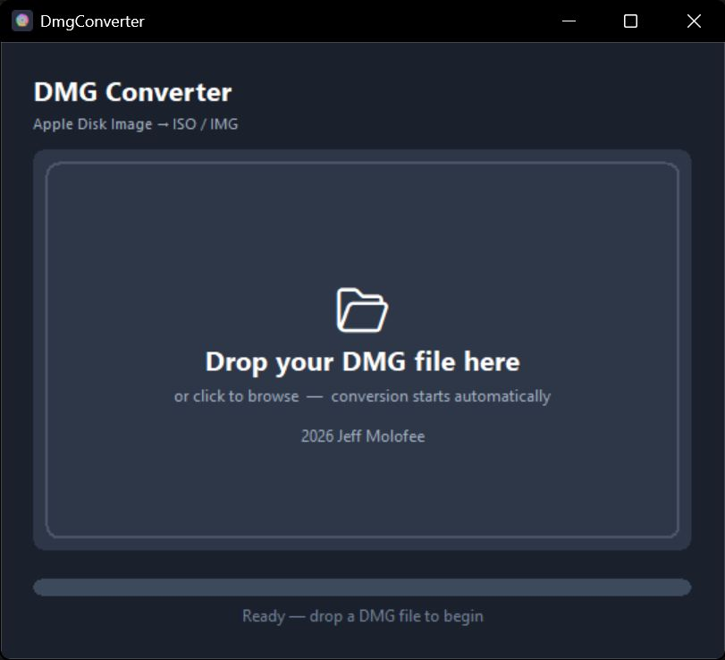

# Dmg Converter

**2026 Jeff Molofee (NeHe)**

Apple Disk Image (`.dmg`) to raw disk image (`.img`) converter for Windows — written in C++17 with no external dependencies.

---

## Typical use case: installing macOS in a VM

The most common reason to use this tool is converting a macOS installer/recovery `.dmg` (for example, a `BaseSystem.dmg` for a given macOS version) into a raw `.img` file that a virtual machine can boot from directly. In QEMU, that looks like attaching the converted file as a plain hard disk:

```
-drive id=InstallMedia,if=none,format=raw,file=output.img
-device ide-hd,bus=sata.3,drive=InstallMedia
```

This works because the conversion preserves the original disk's GPT partition layout exactly — the VM's bootloader (e.g. OpenCore) reads it the same way it would read a real disk.

---

## Recent changes

- **Fixed a critical bug** in the block-copy logic: partition data was being written at the wrong offset in the output file (missing each partition's base sector position), corrupting the GPT layout of every converted image. All conversions before this fix are unusable and should be redone.
- **Removed the VirtualBox VMDK wrapper** (`-vm` flag / GUI auto-wrap). The tool now does one thing — DMG → raw `.img` — rather than also managing a second virtualization platform's disk format.
- **Output is now always `.img`**, never `.iso`. A DMG's disk layout is raw GPT, not a CD-ROM filesystem, so labeling it `.iso` was always misleading — see [Why `.img`, not `.iso`](#why-img-not-iso) below.

---

## Overview

**DMG-Converter is a dual-mode application** — the same single `.exe` works both as a GUI desktop app and as a command-line tool, depending on how you launch it.

| Launch method                      | Mode                                           |
|------------------------------------|------------------------------------------------|
| Double-click `DMG-Converter.exe`   | **GUI** — dark-themed drag & drop window       |
| Run from a terminal with arguments | **CLI** — output goes to your existing console |

No installer required. No Visual C++ Redistributable required. Just download and run.

---

## GUI Mode

Double-click `DMG-Converter.exe` (or run it with no arguments). A dark-themed window opens:

- **Drag & drop** a `.dmg` file onto the window, or **click anywhere** to browse
- Conversion starts automatically — a progress bar tracks the operation
- A dialog confirms completion and shows the output filename
- Output is saved next to the input file as `.img`

<p align="center"></p>

---

## CLI Mode

Run from cmd or PowerShell with arguments:

```
DMG-Converter.exe input.dmg                  Convert to .img
DMG-Converter.exe input.dmg output.img       Convert to a specific output path
DMG-Converter.exe -l input.dmg               List all partitions inside the DMG
DMG-Converter.exe -h                         Show help
```

### Examples

```bat
DMG-Converter.exe installer.dmg
DMG-Converter.exe installer.dmg C:\Images\output.img
DMG-Converter.exe -l installer.dmg
```

---

## Why `.img`, not `.iso`

Modern macOS installer/recovery DMGs are **raw GPT-partitioned disk images** (APFS or HFS+), not CD-ROM filesystems. There's no meaningful way to turn one into a real ISO9660 image — the on-disk structures are fundamentally different formats. Earlier versions of this tool sometimes named the output `.iso`, which was misleading: the bytes were always a raw disk dump, never actual ISO9660. The output is now always `.img`, which is also exactly what tools like QEMU expect when attaching it as a virtual hard disk (`-drive file=output.img,format=raw`).

---

## Supported DMG features

- Block types: **ZLIB**, **RAW**, **ADC**, and zero-fill (**BZIP2** and **LZFSE** are rare in practice and not yet implemented)
- Preserves the DMG's original GPT partition layout byte-for-byte, so the output boots the same way the source disk would
- Uses the Windows native **Compression API** (`cabinet.dll`) — no zlib or third-party libraries

---

## Dependencies

None. The exe links only against Windows system DLLs that ship with every Windows 10/11 install:

`cabinet.dll` · `ole32.dll` · `shell32.dll` · `gdi32.dll` · `user32.dll` · `kernel32.dll`

The MSVC C++ runtime is statically linked, so no VC++ Redistributable is needed.

---

## Building from source

Most people should build this themselves rather than trust a prebuilt `.exe` from a random repo — that's expected, and it's a two-minute process.

### Requirements

An MSVC toolchain is required (the code uses `compressapi.h` / `cabinet.lib`, which are MSVC/Windows SDK-specific — no MinGW/clang support). You don't need the full Visual Studio IDE, just:

- **An MSVC compiler + Windows SDK** — either [Build Tools for Visual Studio 2022](https://visualstudio.microsoft.com/downloads/#build-tools-for-visual-studio-2022) (CLI-only, no IDE, ~2-3GB) or the full Visual Studio 2022 IDE if you already have it
- **CMake 3.20+** (included with either of the above)

Everything below runs from a plain terminal (PowerShell, cmd, or VS Code's integrated terminal) — you never need to open Visual Studio itself.

### Quick build (recommended)

Run **`build.bat`** from the project root:

```bat
build.bat
```

It finds your VS/Build Tools installation automatically, configures CMake, builds a Release x64 binary, and copies `DMG-Converter.exe` to the project root.

**If you don't have an MSVC toolchain installed yet**, `build.bat` detects that and offers to install "Build Tools for Visual Studio 2022" for you via `winget` (asks for confirmation first, since it's a multi-GB download). If you'd rather do it yourself first:

```powershell
winget install --id Microsoft.VisualStudio.2022.BuildTools -e --override "--wait --passive --add Microsoft.VisualStudio.Workload.VCTools --includeRecommended"
```

Then just run `build.bat` as above.

### Manual build

If you prefer not to use `build.bat` (e.g. you already have a Developer Command Prompt open):

```bat
cmake -B build -S . -A x64
cmake --build build --config Release
```

(Deliberately no `-G` — omitting it lets CMake auto-detect whichever Visual Studio version is actually installed, rather than failing if it doesn't match a hardcoded version string.)

Output: `build\Release\DMG-Converter.exe`

---

## Author

2026 Jeff Molofee (NeHe)
